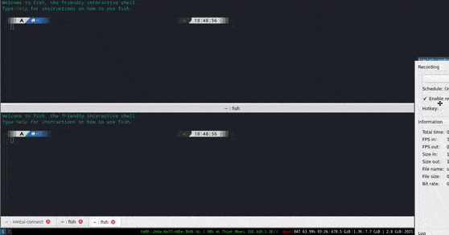

### Usage
```
go get github.com/nhannht/freego

```
- Ensure go version more than 1.11, some Ubuntu distro still use a hopeless old version of go
- Ensure `GOPATH/bin` in your $PATH, type `freego` and use
